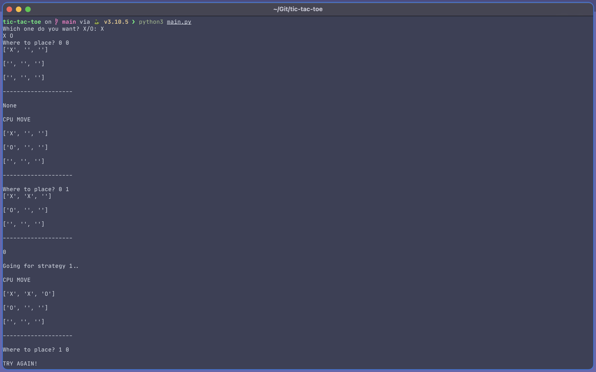

# tic-tac-toe

 
 

Made mainly for the purpose of improving at 2D Arrays. 

---

### Future Scope
---
- Improved AI 
    - Counter player Forks
    - create own forks
- 2 Player Mode
- TKinter Front End
- [exaggeration] - turn this into an engine. 

 
 
### Contributing
---
- Please create an issue for Fixes, Improvments and More! 
---

 

PS. I miss  

